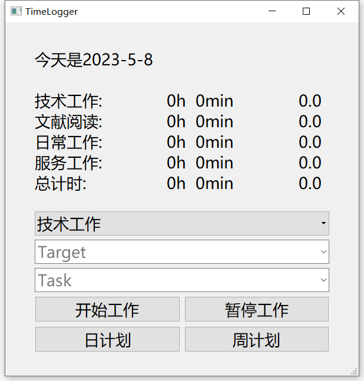
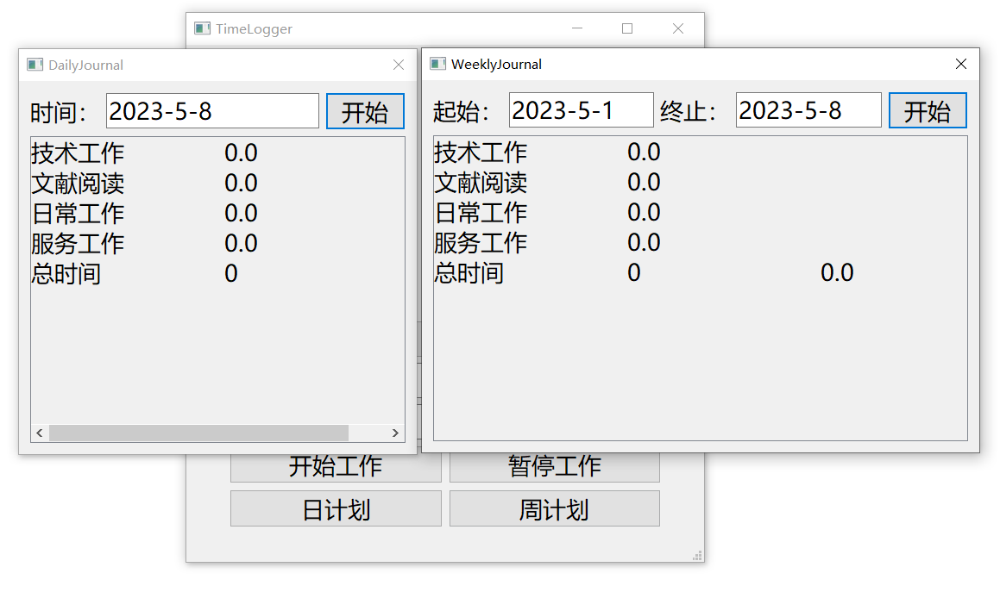

# TimeLogger
这是一个可以记录你有效学习工作时间的小软件，由python实现，简陋但有点用

# 已实现功能
- 点击开始计时
- 点击暂停计时
- 点击结束计时，结束自动保存记录
- 历史记录加载
- 分析单日或者多日工作时间

# 界面截图

# 设计思路
基于
[sysu18364010的MytTime框架](https://github.com/sysu18364010/MytTime)进行改动，前端使用pyqt5增加了更多按钮和文字提示，后端使用sqlite进行交互、使用pandas进行数据分析，使用pyinstall生成exe。

# 可执行文件
无需安装任何环境，直接使用
